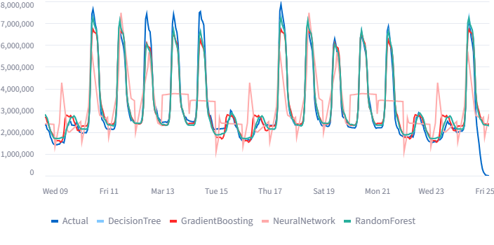

# Energy Forecast Pipeline

## Overview

A full-stack time series forecasting pipeline for hourly energy consumption. The pipeline:
- Pulls raw data from example csv file (data is fictional).
- Transforms and summarizes the data into hour level and calculates the total energy consumption
- Loads into PostgreSQL
- Creates forecast features
- Trains and validates several ML models, compares them and selects the best model to forecast the time series data
- Loads model predictions and their evaluatin metrics to PostgreSQL
- Forecasts 7-day hourly energy usage using the selected best model
- Visualizes with Streamlit, compares and scores the models



## Setup
Boot up the database and dashboard with
```bash
docker-compose up --build
```
(Takes about a minute to boot up)
Then go to: [http://localhost:8501](http://localhost:8501), once you see logging message "Pipeline completed successfully" in the terminal.


## Requirements

- Docker & docker-compose
- Port 5433 on host machine is not in use (if it is, change the port from `docker-compose.yml` file in row 11 e.g. from 5433:5432 to 5434:5432)